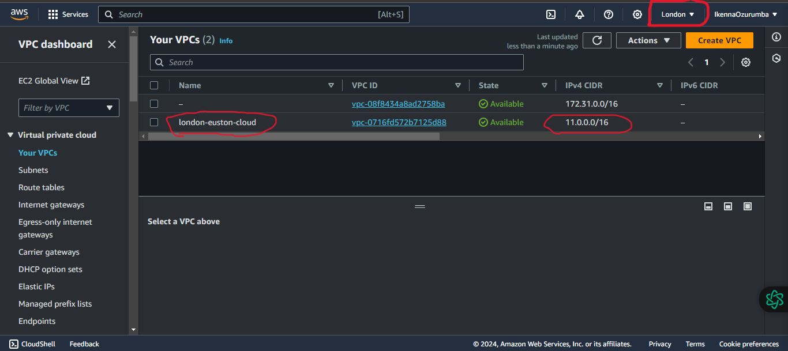
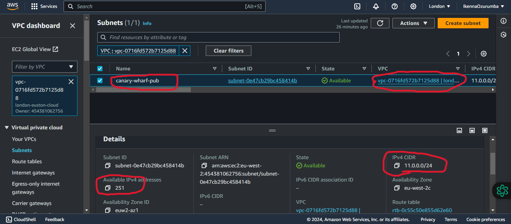
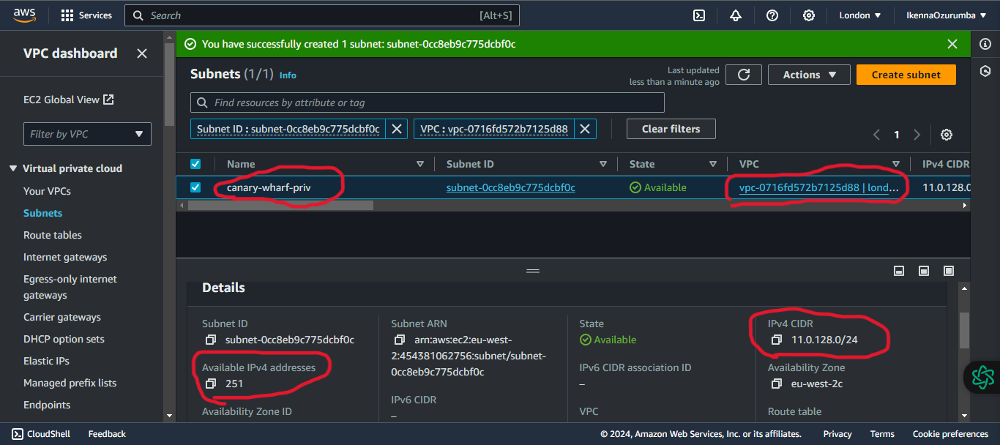
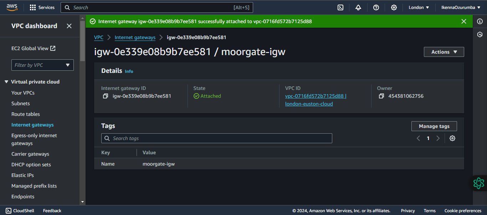
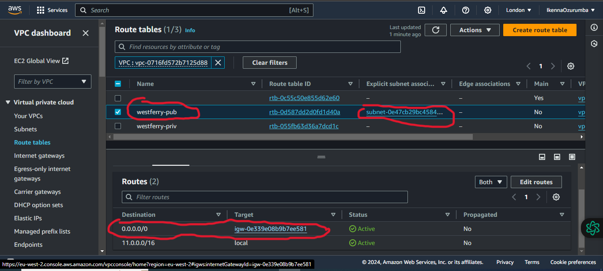
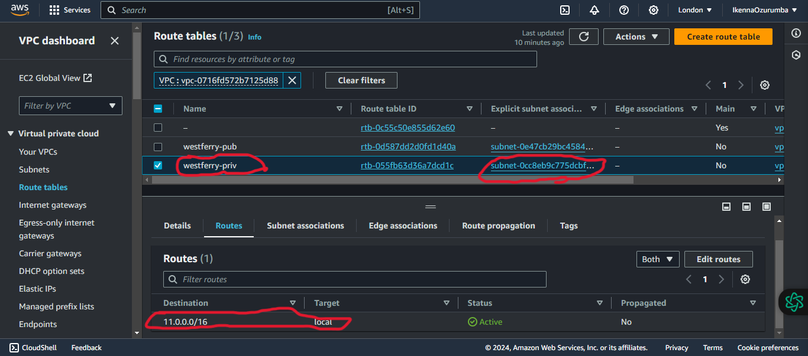
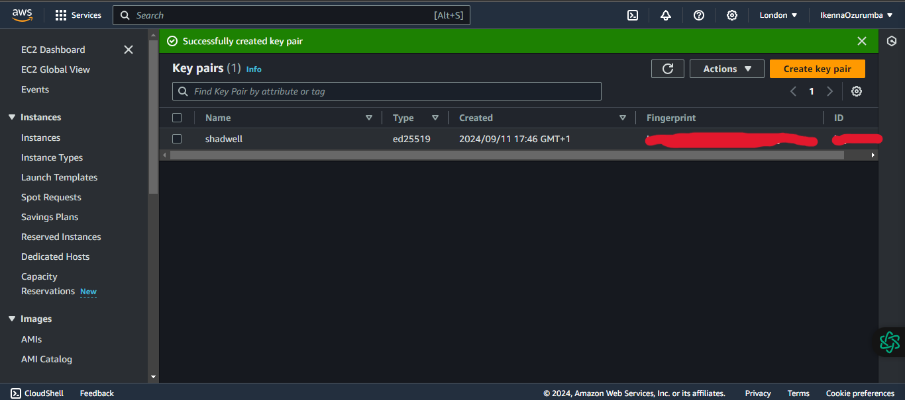
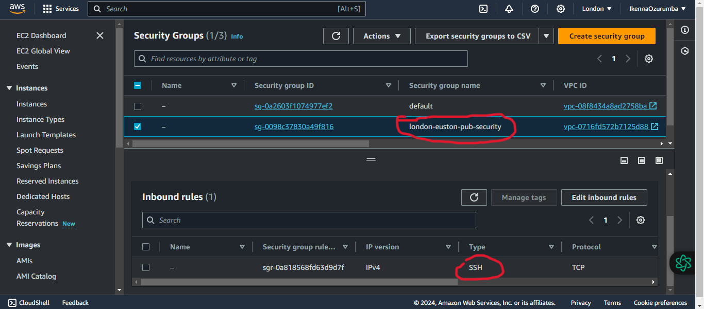
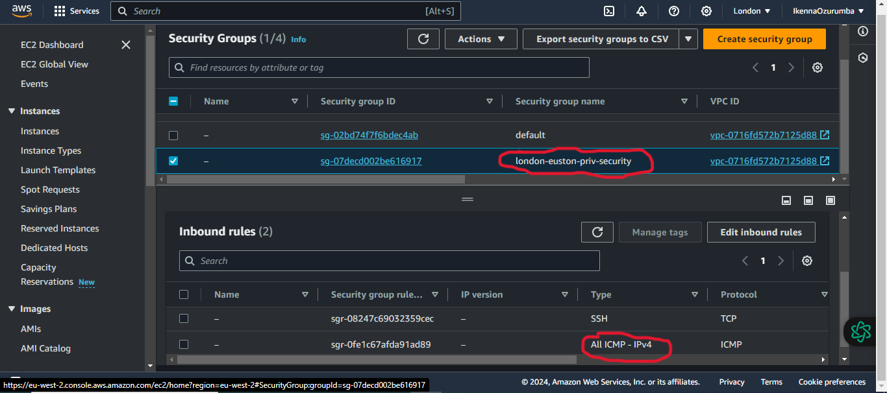

# Task 1

## Create a VPC with public and private subnets, and launch two instances(free-tier), one in the public subnet and another in the private subnet, you must be able to ping the private instance from the public instance through the private IP address of the private instance IP address.

### 1. Create a Virtual Private Cloud (VPC) in the London Region
A VPC was created in the AWS London region with the following details:

- Name: `london-euston-cloud`
- IPv4 CIDR block: `11.0.0.0/16`

An IPv4 CIDR block of 11.0.0.0/16 was selected instead of the default 10.0.0.0/16 to prevent IP address overlap during VPC peering with other networks that are using the default 10.0.0.0/16 IPv4 address range. Additionally, to ensure a sufficient number of IP addresses for connectivity, a /16 CIDR block was chosen. 

### 2. Create a public subnet in london-euston VPC

A public subnet was created with the following details:
- Name: canary-wharf-pub
- VPC: london-euston-cloud
- IPv4 CIDR block: `11.0.0.0/24`

### 3. Create a private subnet in london-euston VPC

A private subnet was created with the following details:
- Name: canary-wharf-priv
- VPC: london-euston-cloud
- IPv4 CIDR block: `11.0.128.0/24`
   

### 4. Create an internet gateway (IGW) and attach it to the london-euston VPC

- Name: `moorgate-igw`

### 5. Create a public route table and set/edit subnet association to the public subnet (canary-wharf-pub)

- Name: `westferry-pub`
- Destination: `0.0.0.0`
- Target: `moorgate-igw`

### 6. Create a private route table and set/edit subnet association to the private subnet (canary-wharf-priv)
- Name: `westferry-priv`
- Destination: 11.0.0.0/16
- Target: Local

This route entry allows communication between instances within the private subnet (canary-wharf-priv) and other instances within the VPC, by keeping the traffic local to the VPC.

# Security

### 7. Create a Key pair security credential for connectivity

### 8. Create a security group with inbound rule to allow SSH from VPC IP address ranges 

### 9. Create a security group with inbound rule to allow SSH and ICMP traffic from the public security group

ICMP (Internet Control Message Protocol) traffic is enabled to send error messages, operational information, diagnotic data e.g., to test network connectivity between instances using the ping command to send echo requests.

