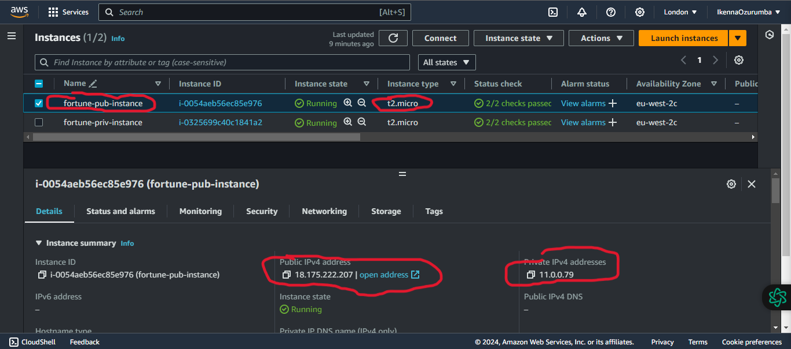
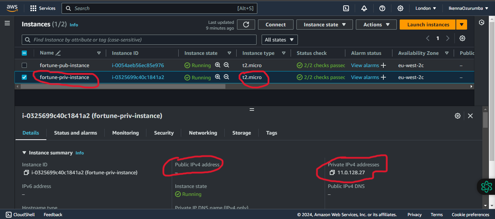
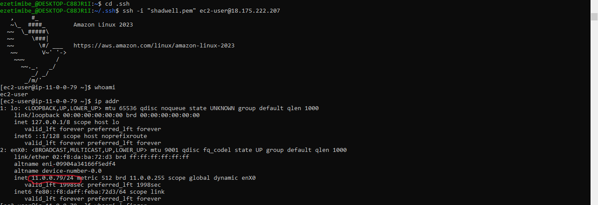
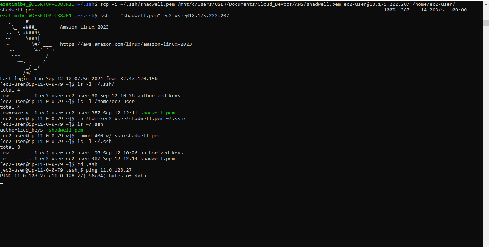
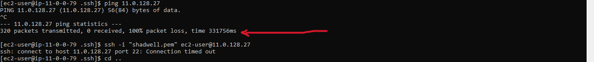
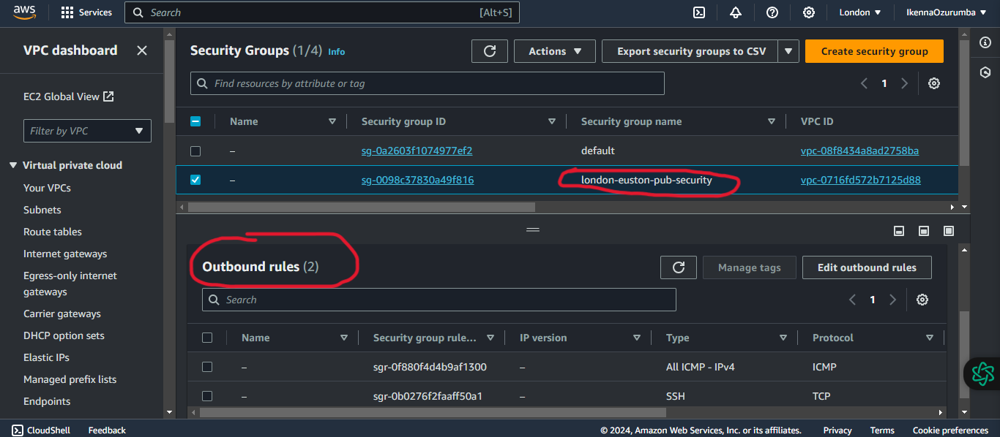
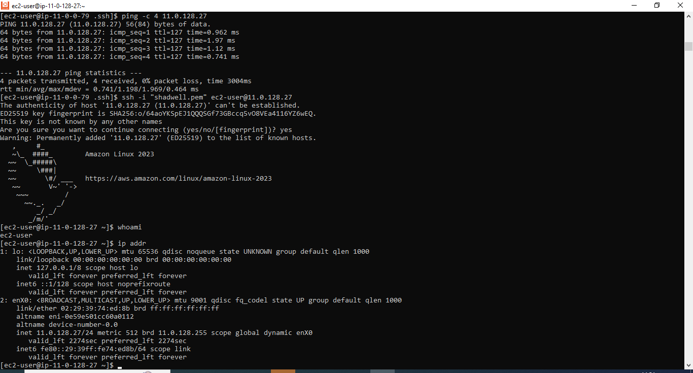

# Task 1

## Create a VPC with public and private subnets, and launch two instances(free-tier), one in the public subnet and another in the private subnet, you must be able to ping the private instance from the public instance through the private IP address of the private instance IP address.

### 1. Create a Virtual Private Cloud (VPC) in the London Region
A VPC was created in the AWS London region with the following details:

- Name: `london-euston-cloud`
- IPv4 CIDR block: `11.0.0.0/16`

An IPv4 CIDR block of 11.0.0.0/16 was selected instead of the default 10.0.0.0/16 to prevent IP address overlap during VPC peering with other networks that are using the default 10.0.0.0/16 IPv4 address range. Additionally, to ensure a sufficient number of IP addresses for connectivity, a /16 CIDR block was chosen. 

### 2. Create a public subnet in london-euston VPC

A public subnet was created with the following details:
- Name: canary-wharf-pub
- VPC: london-euston-cloud
- IPv4 CIDR block: `11.0.0.0/24`

### 3. Create a private subnet in london-euston VPC

A private subnet was created with the following details:
- Name: canary-wharf-priv
- VPC: london-euston-cloud
- IPv4 CIDR block: `11.0.128.0/24`
   

### 4. Create an internet gateway (IGW) and attach it to the london-euston VPC

- Name: `moorgate-igw`

### 5. Create a public route table and set/edit subnet association to the public subnet (canary-wharf-pub)

- Name: `westferry-pub`
- Destination: `0.0.0.0`
- Target: `moorgate-igw`

### 6. Create a private route table and set/edit subnet association to the private subnet (canary-wharf-priv)
- Name: `westferry-priv`
- Destination: 11.0.0.0/16
- Target: Local

This route entry allows communication between instances within the private subnet (canary-wharf-priv) and other instances within the VPC, by keeping the traffic local to the VPC.

# Security

### 7. Create a Key pair security credential for connectivity

### 8. Create a security group with inbound rule to allow SSH from local host IP address

### 9. Create a security group with inbound rule to allow SSH and ICMP traffic from the public security group

ICMP (Internet Control Message Protocol) traffic is enabled to send error messages, operational information, diagnotic data e.g., to test network connectivity between instances using the ping command to send echo requests.

### 10. launch a free tier EC2 instance in the public subnet

- Name: fortune-pub-instance
- Software Image(AMI): Amazon Linux 2023 AMI
- Virtual server type: t2.micro
- Storage: 8Gib gp3 Root volume
- VPC: london-euston-cloud
- Subnet: canary-wharf-pub
- Security group: london-euston-pub-security
- key pair: shadwell.pem
- Auto-assign public IP: Enable

### 11. launch a free tier EC2 instance in the private subnet

- Name: fortune-priv-instance
- Software Image(AMI): Amazon Linux 2023 AMI
- Virtual server type: t2.micro
- Storage: 8Gib gp3 Root volume
- VPC: london-euston-cloud
- Subnet: canary-wharf-priv
- Security group: london-euston-priv-security
- key pair: shadwell.pem
- Auto-assign public IP: Disable

### 12. SSH from local host into public instance

The keypair private key `shadwell.pem` was copied into the `.ssh` directory of the local linux pc to enable secure authentication with the public instance `fortune-pub-instance`.

Due to inbound rule to allow SSH from the local host IP address set in the `london-euston-pub-security` security group, it was possible to ssh into the public EC2 instance. 

### 13. Copy private key from local PC into the Public Instance 

The private key `shadwell.pem` was securely copied from the local host into the .ssh directory of the public EC2 instance `fortune-pub-instance` to enable authentication with the private EC2 instance `fortune-priv-instance`.

### 14. Ping and SSH from public instance into private instance

Lack of outbound SSH and ICMP traffic in the public security group `london-euston-pub-security` prevented ICMP echo request and SSH authentication from the IP address of the public EC2 instance into the private EC2 instance as shown in the picture below.

### 15. Modify public security group rule

The public security group rule was modified to allow outbound SSH connections to instances in the private security group. Additionally, all ICMP IPv4 traffic was enabled.

As a result, SSH authentication and ping network packet requests were successful.

