# Task 2

## a. Create a VPC with two availability zones, a public and private subnet in each zone, and launch two instances(free-tier) in one of the zones, one in the public subnet and another in the private subnet.

## b. Create a vpc peering connection between the two VPC's (London region and US East N.Virginia region), ping the private instance in region b from the private instance in region a. *This means that you have to ssh into the private instances in both regions

### 1. Create a Virtual Private Cloud (VPC) in US East N.Virginia region

- Name: `north-virginia-cloud`
- IPv4 CIDR block: `15.0.0.0/16`

An IPv4 CIDR block of 15.0.0.0/16 was selected to prevent IP address overlap.

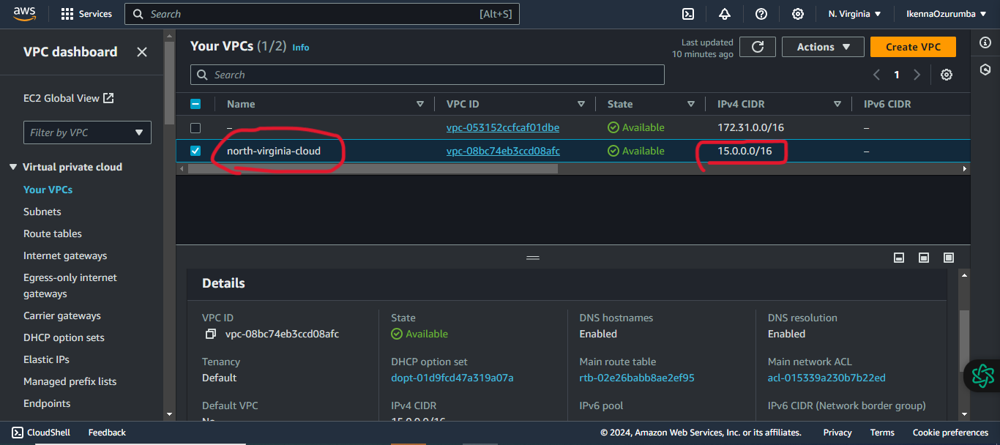

### 2. Create public and private subnets in each zone

Two public and two private subnets was created in each zone:

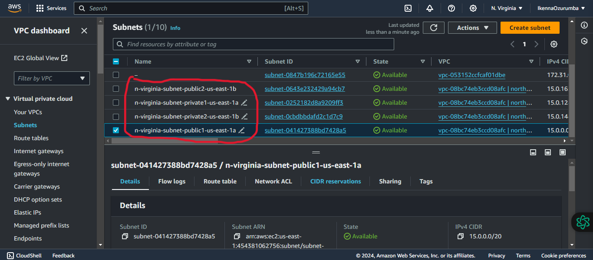

### 3. Create an internet gateway (IGW) and attach it to the N.Virgina VPC

- Name: `n-virginia-igw`

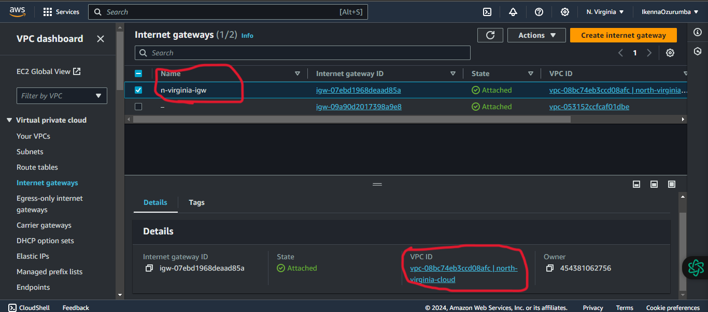

### 4. Create an S3 (simple storage service) endpoint in the VPC 

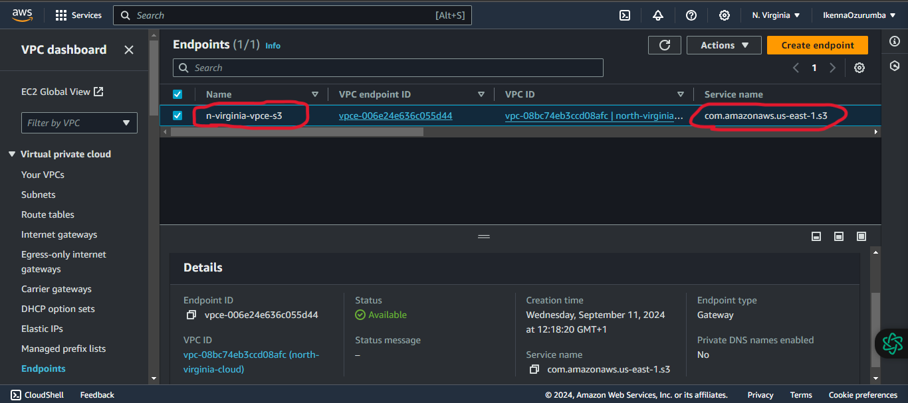

### 5. In the VPC, Create a public route table and associate it with public subnets and private route tables associated with private subnets

A public route table to route traffic to the VPC and the internet with the following details was created: 

- Name: `n-virginia-rtb-public`
- Destination: `0.0.0.0` & `15.0.0.0/16`
- Target: `n-virginia-igw` & `local`

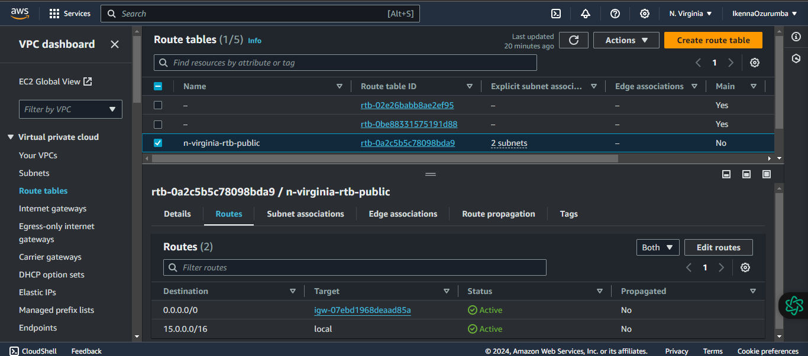

Two private route table to route traffic to the VPC and an S3 endpoint were created:

- Name: `n-virginia-rtb-private1-us-east-1a`
- Destination: `pl-63a5400a` & `15.0.0.0/16`
- Target: `vpce-006e24e636c055d44` & `local`

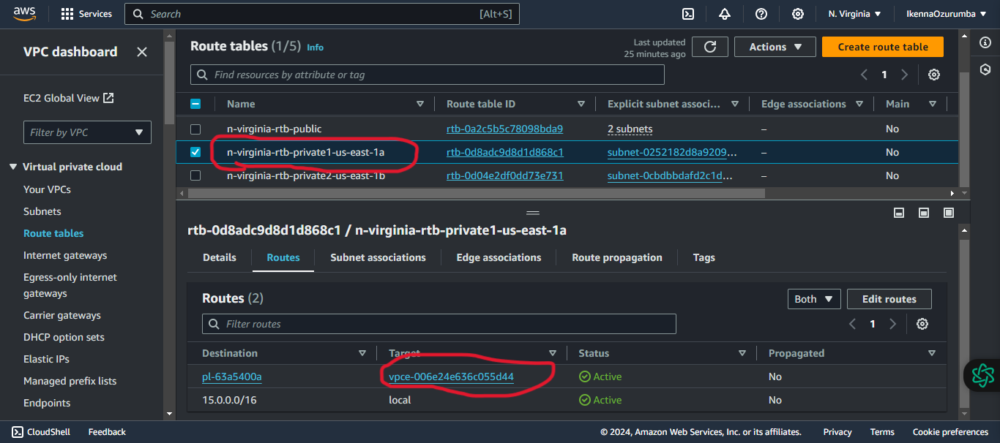

- Name: `n-virginia-rtb-private2-us-east-1b`
- Destination: `pl-63a5400a` & `15.0.0.0/16`
- Target: `vpce-006e24e636c055d44` & `local`

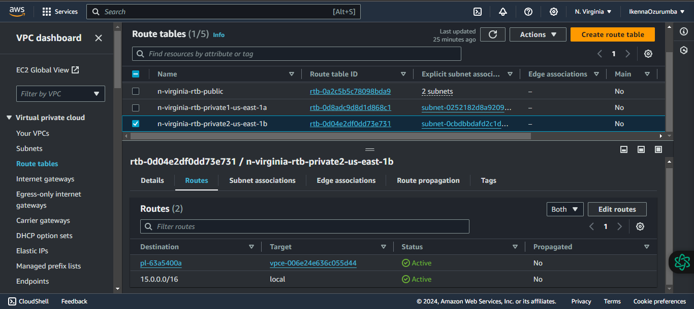

# Resource Map

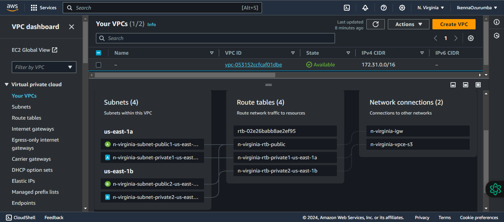

# Security

### 6. Create a Key pair security credential

- Name: `ashburn.pem`

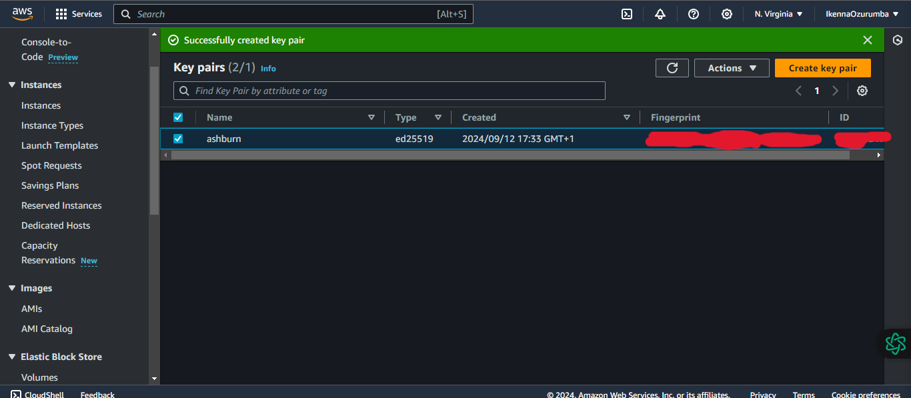

### 7. Create a public security group

A public security group was created with the following rules:
- inbound rule: allow SSH traffic from local host IP address and ICMP traffic from All ICMP IPv4 addres
- outbound rule: allow SSH and ICMP traffic to private security group
  
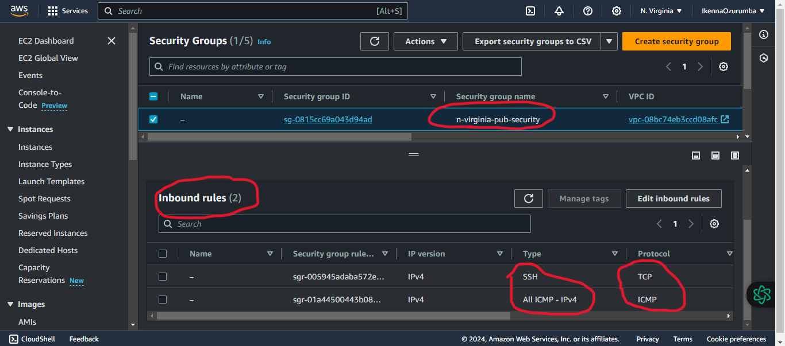

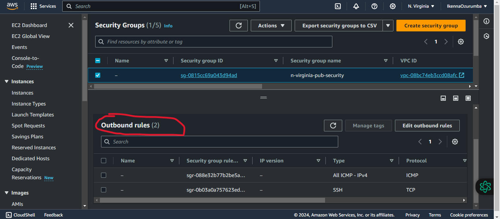

### 8. Create a private security group

A private security group was created with the following rules:
- inbound rule: allow SSH and ICMP traffic from public security group

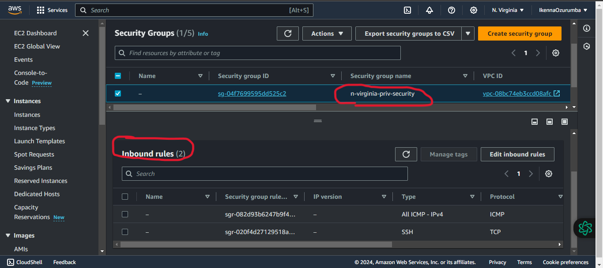

### 9. launch a free tier EC2 instance in one of the public subnet

- Name: n-virginia-pub-instance
- Software Image(AMI): Canonical, Ubuntu, 24.04, amd64 noble image ami-0e86e20dae9224db8
- Virtual server type: t2.micro
- Storage: 8Gib gp3 Root volume
- VPC: north-virginia-cloud
- Subnet: n-virginia-subnet-public1-us-east-1a
- Security group: n-virginia-pub-security
- key pair: ashburn.pem
- Auto-assign public IP: Enable

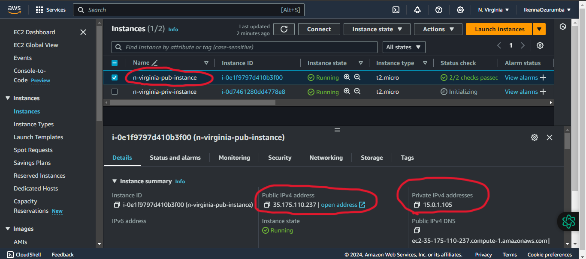

### 10. launch a free tier EC2 instance in one of the private subnet

- Name: n-virginia-priv-instance
- Software Image(AMI): Debian 12 (20240717-1811) ami-064519b8c76274859
- Virtual server type: t2.micro
- Storage: 8Gib gp3 Root volume
- VPC: north-virginia-cloud
- Subnet: n-virginia-subnet-private1-us-east-1a
- Security group: n-virginia-priv-security
- key pair: ashburn.pem
- Auto-assign public IP: Disable

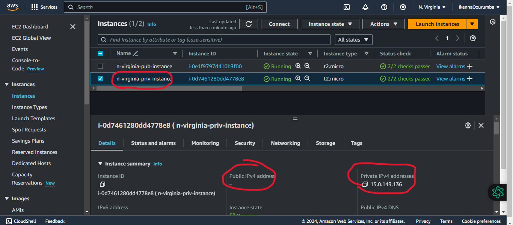

### 11. SSH from local host into public instance

The keypair private key `ashburn.pem` was copied into the `.ssh` directory of the local linux pc to enable authentication with the public instance. 

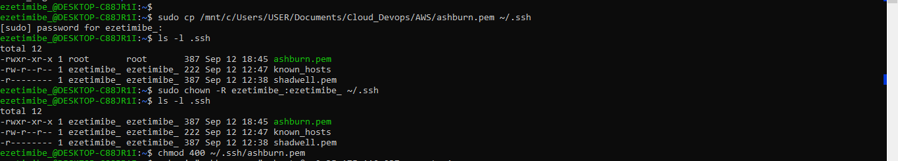

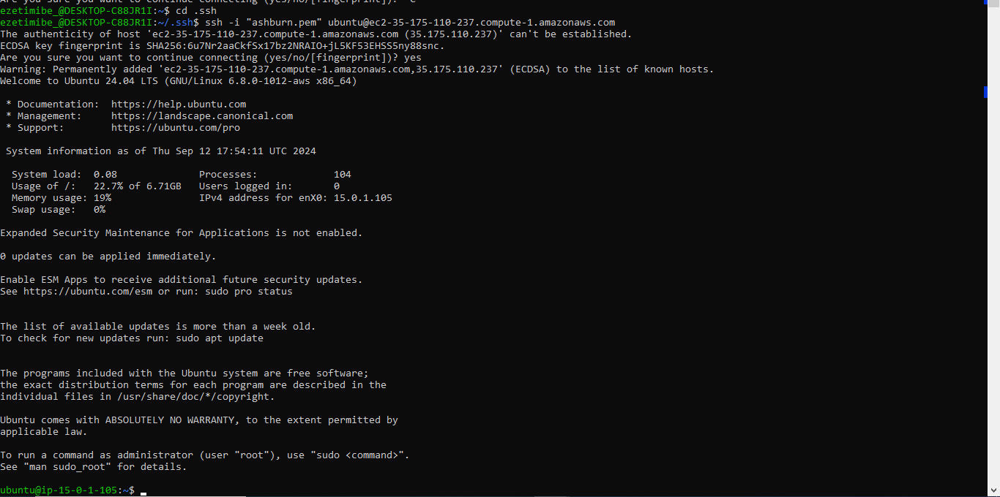

### 12. Copy private key from local PC into the Public Instance 

The private key `ashburn.pem` was securely copied from the local host into the .ssh directory of the public EC2 instance to enable authentication with the private EC2 instance.

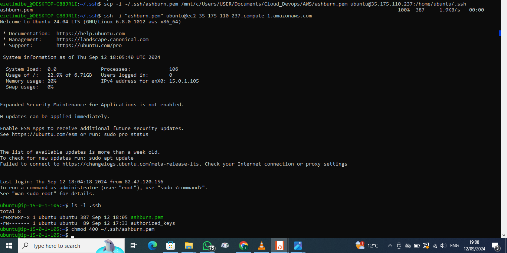

### 13. Ping and SSH from public instance into private instance

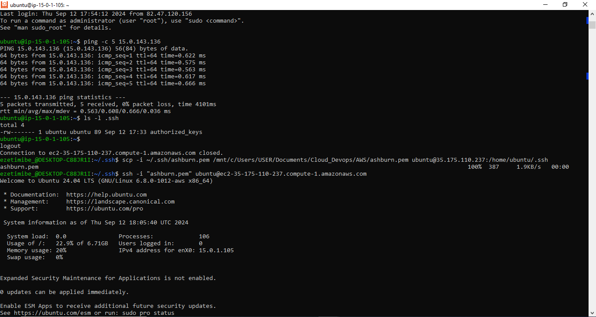

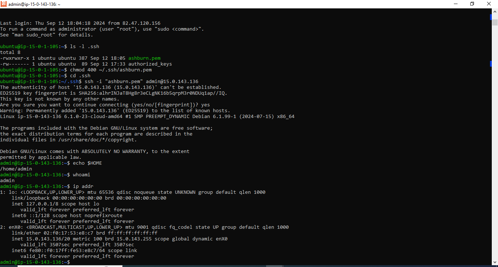
